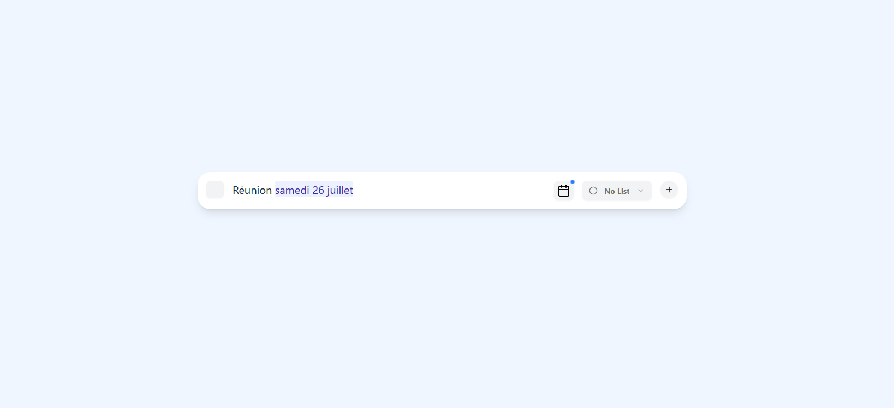

# 📝 Todo Form avec Détection de Dates



## 🚀 À propos

Une application todo intelligente qui **détecte automatiquement les dates** dans vos tâches. Écrivez "Appeler Paul demain" et regardez la date être automatiquement surlignée et synchronisée avec le calendrier.

## ✨ Fonctionnalités

- 🧠 **Détection automatique** : Reconnaît "demain", "lundi prochain", "le 15 août"
- 🎨 **Surlignage intelligent** : Animation visuelle des dates détectées
- 📅 **Synchronisation calendrier** : Badge bleu et sélection bidirectionnelle
- ⚡ **Temps réel** : Détection instantanée pendant la frappe

## 🛠️ Technologies

**Next.js** • **TypeScript** • **Tailwind CSS** • **Framer Motion** • **chrono-node**

## 📦 Installation

```bash
git clone https://github.com/DarilDivin/todo-form.git
cd todo-form
npm install
npm run dev
```

## 🧪 Exemples

```
✅ "Réunion demain à 14h"     → Détecte demain 14h00
✅ "Appel lundi prochain"     → Détecte lundi prochain  
✅ "Deadline le 15 août"      → Détecte 15 août
```

## 📄 Licence

MIT - Voir [LICENSE](LICENSE)